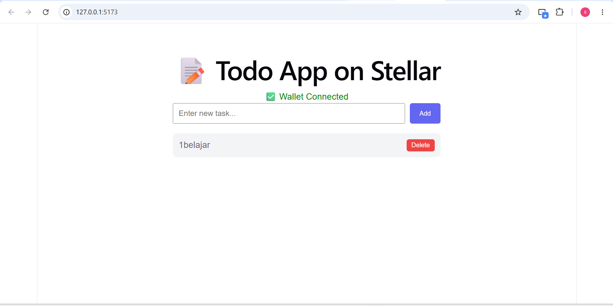
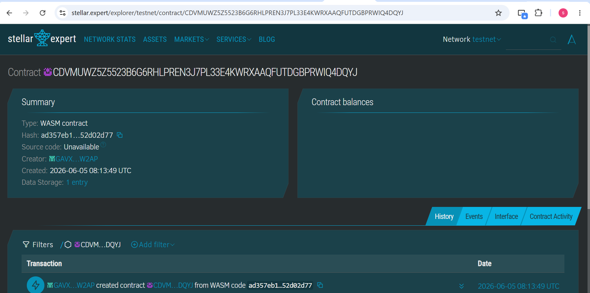

# 📝 Todo App on Stellar

A decentralized Todo application built on the Stellar blockchain using Soroban Smart Contract SDK.

## Project Description
Stellar Todo DApp is a decentralized smart contract solution built on the Stellar blockchain using Soroban SDK. It provides a secure, immutable platform for managing personal tasks directly on the blockchain.

## Key Features
1. **Add Tasks** - Create tasks stored permanently on the Stellar blockchain
2. **View Tasks** - Fetch all stored tasks in a single call
3. **Delete Tasks** - Remove specific tasks using their unique IDs
4. **Wallet Integration** - Connect with Freighter wallet to sign transactions

## Smart Contract
- **Contract ID (Mainnet):** `CB3NXYZUHWG7PPTS3PIUPKTCUHBA5Q5TBGIYMHRRPRJNZLIWZRDGRQE3`
- **Contract ID (Testnet):** `CDVMUWZ5Z5523B6G6RHLPREN3J7PL33E4KWRXAAQFUTDGBPRWIQ4DQYJ`
- **Network:** Stellar Mainnet
- **Functions:** `add_task`, `get_tasks`, `delete_task`

## Tech Stack
- Rust + Soroban SDK (Smart Contract)
- React + Vite (Frontend)
- Stellar Contracts Kit
- Freighter Wallet

## Live Demo
https://stellar-todo-app.vercel.app

## How to Run
1. Clone this repository
2. Install dependencies: `cd frontend && npm install`
3. Run: `npm run dev`
4. Open: `http://localhost:5173`
5. Connect Freighter wallet (set to Mainnet)

## Frontend Screenshot

## Testnet Screenshot

## Future Scope
- Task Categories - Add tags and categories to organize tasks
- Task Priority - Set priority levels for each task
- Due Dates - Add deadline functionality to tasks
- Collaborative Tasks - Share tasks with other Stellar addresses
- Mobile App - Build mobile version of the Todo App
